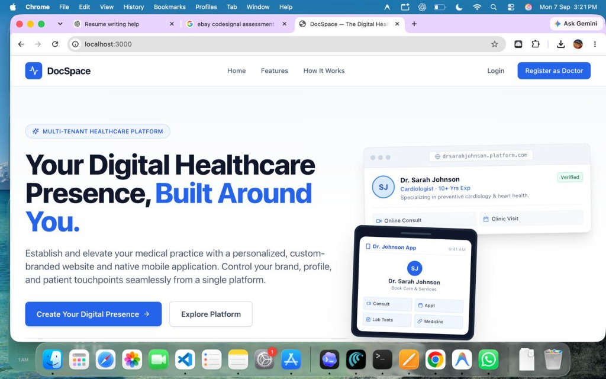
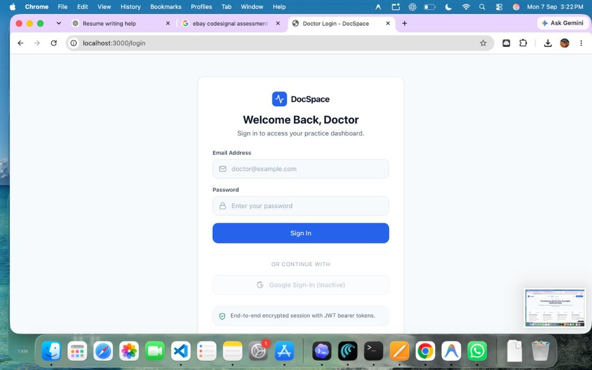
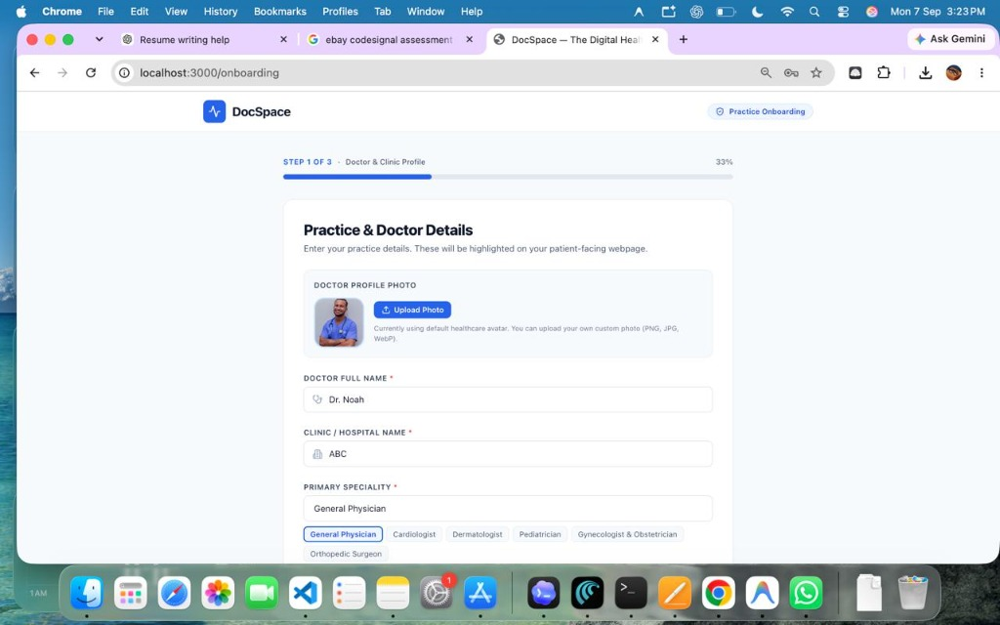

# DocSpace — Multi-Tenant White-Label Doctor Platform

A modern B2B SaaS platform enabling doctors and healthcare specialists to create, brand, and manage their dedicated digital presence, personalized website, and patient mobile application from a single dashboard.

## Screenshots

### Web Platform Showcase

| Landing Page (Hero) | Platform Capabilities |
| :---: | :---: |
|  |  |

| How It Works | Doctor Login |
| :---: | :---: |
|  |  |

## Tech Stack

- **Framework**: [Next.js](https://nextjs.org/) (App Router)
- **Language**: [TypeScript](https://www.typescriptlang.org/)
- **Styling**: [Tailwind CSS](https://tailwindcss.com/)
- **Icons**: [Lucide React](https://lucide.dev/)

## Project Structure

```text
Doctors Platform/
├── app/
│   ├── layout.tsx         # Root layout with Inter font and global styles
│   ├── page.tsx           # Public platform landing page
│   ├── globals.css        # Tailwind directives and base styles
│   ├── login/
│   │   └── page.tsx       # Placeholder login page
│   └── register/
│       └── page.tsx       # Placeholder doctor registration page
│
├── components/
│   └── landing/
│       ├── Navbar.tsx     # Responsive navigation header
│       ├── Hero.tsx       # Hero section with dual CSS mockups & CTAs
│       ├── Features.tsx   # Core platform capabilities grid
│       ├── HowItWorks.tsx # 3-step connected onboarding process
│       ├── PreviewSection.tsx # Split website + mobile preview mockups
│       ├── CTA.tsx        # Final conversion section
│       └── Footer.tsx     # Platform footer with links
│
├── public/                # Static assets
├── package.json
├── tsconfig.json
├── tailwind.config.ts
└── postcss.config.mjs
```

## Getting Started

### Prerequisites

- Node.js 18+
- npm / yarn / pnpm

### Installation

```bash
npm install
```

### Running Locally

```bash
npm run dev
```

Open [http://localhost:3000](http://localhost:3000) in your browser to view the landing page.

### Building for Production

```bash
npm run build
npm run start
```
