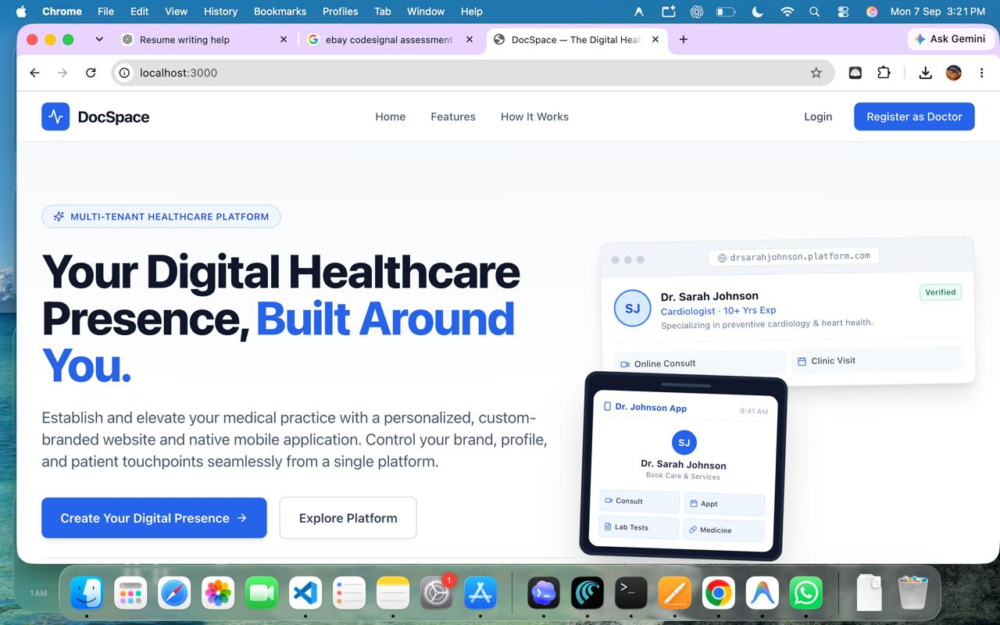
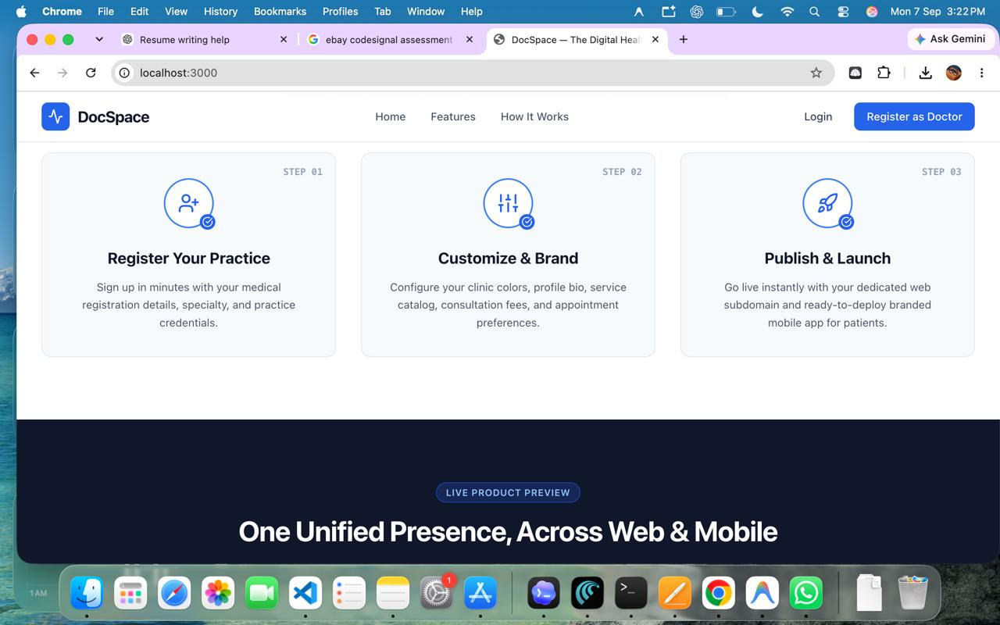
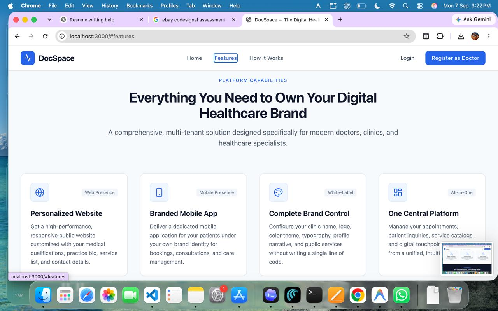
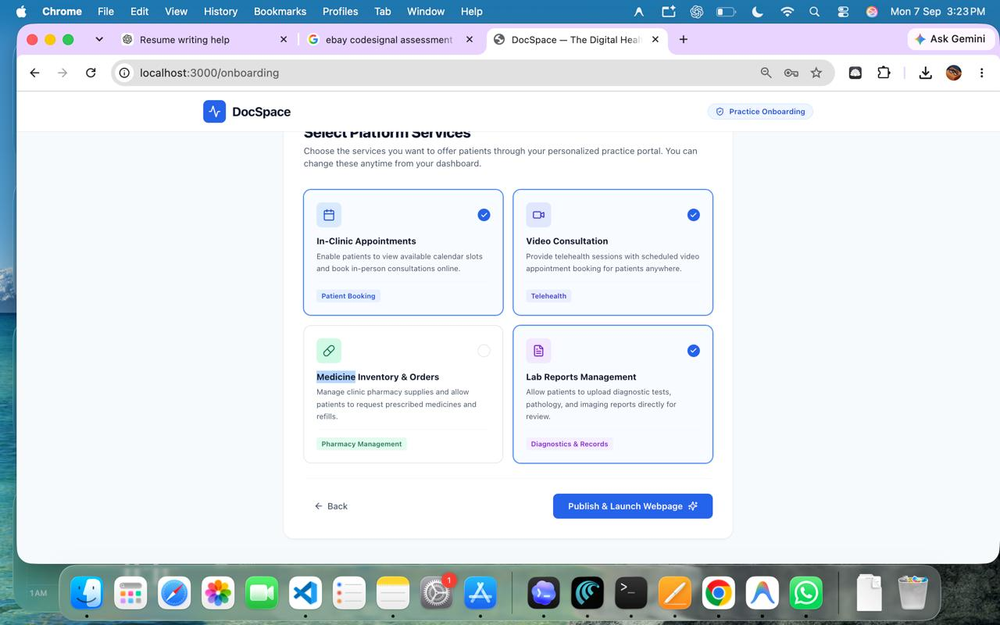
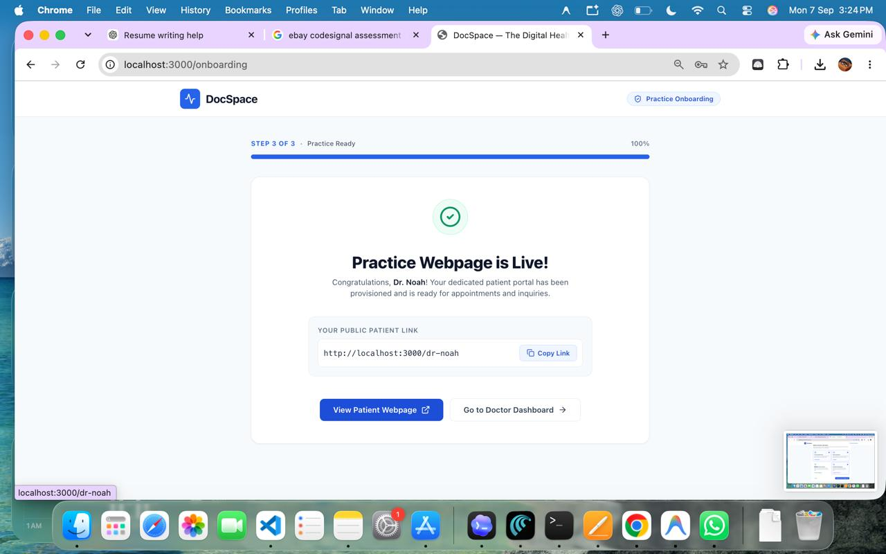
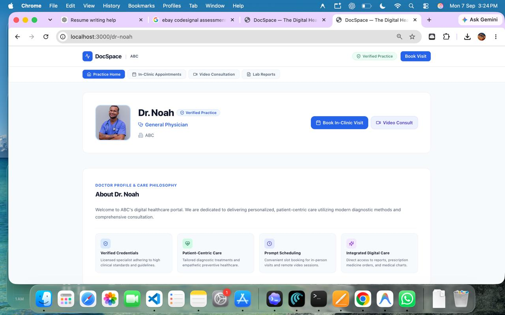
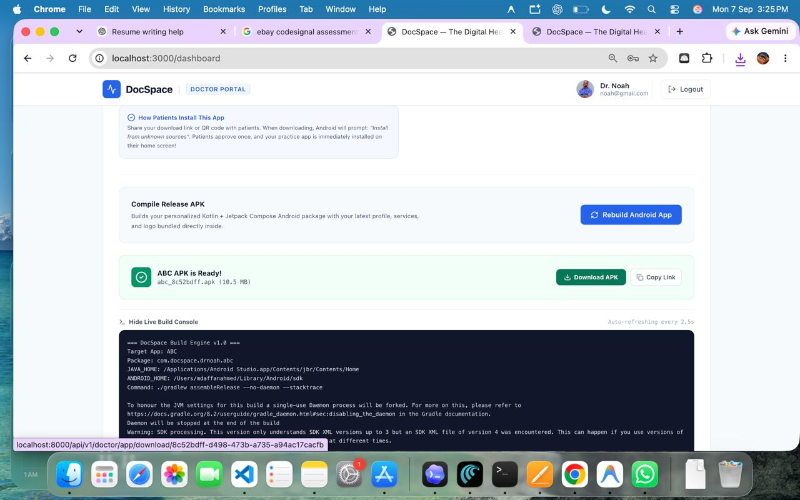
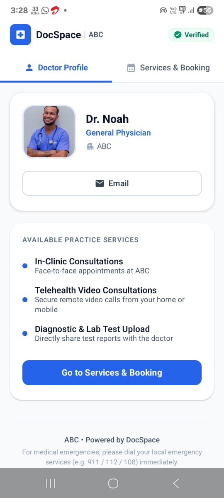
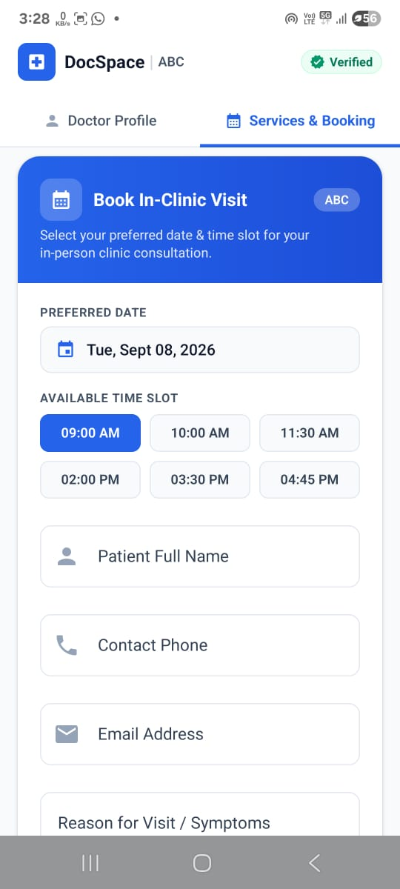
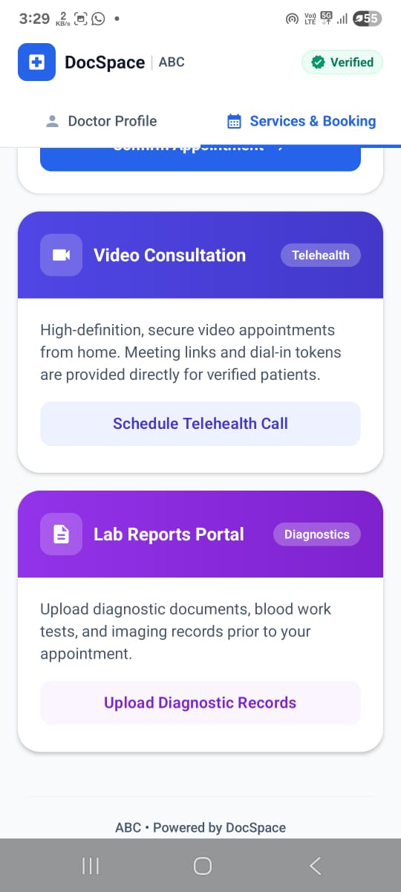

# DocSpace — Multi-Tenant White-Label Doctor Platform

A modern B2B SaaS platform enabling doctors and healthcare specialists to create, brand, and manage their dedicated digital presence — personalized website, patient portal, and native mobile application — all from a single dashboard.

---

## 📸 Platform Flow — Step by Step

### Step 1 · Landing Page — Hero Section (`/`)

The public marketing homepage. Doctors land here and see the value proposition with live mockups of a branded web profile and patient mobile app.



---

### Step 2 · How It Works (`/#how-it-works`)

Three-step onboarding overview: **Register Your Practice → Customize & Brand → Publish & Launch**. Below it, the "One Unified Presence, Across Web & Mobile" live product preview begins.



---

### Step 3 · Platform Features (`/#features`)

Core platform capabilities grid — **Personalized Website**, **Branded Mobile App**, **Complete Brand Control**, and **One Central Platform** — each with descriptive cards.



---

### Step 4 · Doctor Login (`/login`)

Secure authentication page — "Welcome Back, Doctor" — with Email/Password sign-in, Google Sign-In integration, and end-to-end encrypted JWT session security.


---

### Step 5 · Onboarding Wizard — Step 1 of 3: Practice & Doctor Details (`/onboarding`)

The guided practice setup begins. Doctor fills in profile photo, full name, clinic/hospital name, and selects a primary speciality (General Physician, Cardiologist, Dermatologist, Pediatrician, etc.).


---

### Step 6 · Onboarding Wizard — Step 3 of 3: Select Platform Services (`/onboarding`)

Final onboarding step. Doctor toggles which services to offer patients: **In-Clinic Appointments**, **Video Consultation**, **Medicine Inventory & Orders**, and **Lab Reports Management**. Hit "Publish & Launch Webpage" to go live.



---

### Step 7 · Practice Webpage is Live! (`/onboarding` — Completion)

Success confirmation — "Practice Webpage is Live!" with the doctor's public patient link (`/dr-noah`), a "Copy Link" button, and CTAs to view the patient webpage or go to the doctor dashboard.



---

### Step 8 · Patient-Facing Practice Portal (`/dr-noah`)

The public patient webpage auto-generated from the doctor's profile. Shows doctor credentials, verified badge, speciality, care philosophy, 4 clinical commitment pillars, and service navigation tabs (Practice Home, In-Clinic Appointments, Video Consultation, Lab Reports).



---

### Step 9 · Doctor Dashboard — APK Builder (`/dashboard`)

The authenticated doctor dashboard with the Android APK builder. Shows live build console, "Rebuild Android App" button, and downloadable APK file with copy link functionality. Powered by the DocSpace Build Engine v1.0.



---

### Step 10 · Mobile App — Doctor Profile (Android APK)

The branded Android mobile app (installed from the built APK). Shows the doctor profile tab with verified badge, speciality, clinic name, email contact, available practice services list, and "Go to Services & Booking" CTA. Footer shows "Powered by DocSpace".



---

### Step 11 · Mobile App — In-Clinic Booking (Android APK)

The "Services & Booking" tab in the mobile app. Patients can book in-clinic visits by selecting a preferred date, available time slot (09:00 AM – 04:45 PM), and entering their name, phone, email, and reason for visit.



---

### Step 12 · Mobile App — Video Consultation & Lab Reports (Android APK)

Additional services in the mobile app: **Video Consultation** (schedule telehealth calls with HD secure video) and **Lab Reports Portal** (upload diagnostic documents, blood work, and imaging records). Each service has its own branded card with action buttons.



---

## 🛠 Tech Stack

### Frontend
- **Framework**: [Next.js 14](https://nextjs.org/) (App Router)
- **Language**: [TypeScript](https://www.typescriptlang.org/)
- **Styling**: [Tailwind CSS](https://tailwindcss.com/)
- **Icons**: [Lucide React](https://lucide.dev/)

### Backend
- **API**: [FastAPI](https://fastapi.tiangolo.com/) (Python 3.12+)
- **ORM**: [SQLAlchemy 2.x](https://www.sqlalchemy.org/)
- **Database**: PostgreSQL 16 / SQLite (dev)
- **Auth**: PBKDF2-HMAC-SHA256 + JWT (PyJWT)
- **Migrations**: [Alembic](https://alembic.sqlalchemy.org/)

### Mobile
- **Android**: Kotlin + Jetpack Compose (auto-built APK per tenant)

---

## 📁 Project Structure

```text
doctors-platform/
├── app/                          # Next.js App Router pages
│   ├── page.tsx                  # Public landing page (/)
│   ├── login/page.tsx            # Doctor login (/login)
│   ├── register/page.tsx         # Doctor registration (/register)
│   ├── onboarding/page.tsx       # 3-step onboarding wizard (/onboarding)
│   ├── dashboard/page.tsx        # Doctor dashboard (/dashboard)
│   └── [slug]/page.tsx           # Patient-facing portal (/dr-noah)
│
├── components/
│   └── landing/                  # Landing page sections
│       ├── Navbar.tsx            # Responsive navigation header
│       ├── Hero.tsx              # Hero with web + mobile mockups
│       ├── Features.tsx          # Platform capabilities grid
│       ├── HowItWorks.tsx        # 3-step onboarding process
│       ├── PreviewSection.tsx    # Live product preview
│       ├── CTA.tsx               # Conversion section
│       └── Footer.tsx            # Platform footer
│
├── backend/                      # FastAPI backend
│   └── app/
│       ├── routers/              # API route modules
│       ├── models/               # SQLAlchemy models
│       ├── services/             # Business logic
│       └── migrations/           # Alembic migrations
│
├── android-template/             # Kotlin + Compose APK template
├── public/screenshots/           # Platform screenshots (1–12)
├── lib/api.ts                    # Frontend API client
├── docker-compose.yml            # PostgreSQL container
└── package.json
```

---

## 🚀 Getting Started

### Prerequisites

- Node.js 18+
- Python 3.12+
- npm / yarn / pnpm
- Docker (for PostgreSQL)

### Installation

```bash
# Frontend
npm install

# Backend
cd backend
pip install -r requirements.txt
```

### Running Locally

```bash
# Start PostgreSQL
docker-compose up -d

# Start Backend (port 8000)
cd backend
uvicorn app.main:app --reload

# Start Frontend (port 3000)
npm run dev
```

Open [http://localhost:3000](http://localhost:3000) in your browser.

### Building for Production

```bash
npm run build
npm run start
```

---

## 📋 Development Phases

| Phase | Status | Description |
| :---: | :---: | :--- |
| 1 | ✅ Complete | Foundation & public landing page |
| 2 | ✅ Complete | Backend foundation (FastAPI, SQLAlchemy, PostgreSQL) |
| 3 | ✅ Complete | Authentication & Doctor Registration |
| 4 | ✅ Complete | Doctor Onboarding & Profile Management |
| 5 | ✅ Complete | Public Patient-Facing Practice Portal |
| 6 | 🔜 Upcoming | Custom Branding & Subdomain Routing |
| 7 | 🔜 Upcoming | Patient Management & Clinical Records |
| 8 | 🔜 Upcoming | Payment Gateway Integration |
