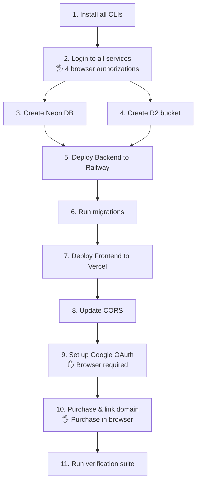

# 🚀 AI-Agent Deployment Plan — Doctors Platform

> **Goal:** Take the project live using CLI tools I can run directly, with clear handoffs for the few steps that require browser interaction.

---

## Overview: What the Agent Can & Can't Do

| Category | Agent Can Do ✅ | Needs Your Browser 🖐️ |
|---|---|---|
| **Database** | Create DB via Neon CLI, get connection string | Sign up for Neon account (first time only) |
| **File Storage** | Create R2 bucket, generate API tokens via Wrangler CLI | Sign up for Cloudflare account (first time) |
| **Backend Deploy** | Deploy via Railway CLI, set env vars, run migrations | Sign up for Railway account (first time) |
| **Frontend Deploy** | Deploy via Vercel CLI, set env vars, link domain | Sign up for Vercel account (first time) |
| **Domain** | Configure DNS via CLI (if using Cloudflare) | Purchase domain (Namecheap/Cloudflare/Google) |
| **Google OAuth** | Generate secrets, prepare config | Configure in Google Cloud Console (browser) |
| **Sentry** | Set up via CLI | Sign up for Sentry account (first time) |
| **Verification** | Run all health checks, test endpoints | — |

---

## Pre-requisites: Install CLIs

I'll install all required CLIs via npm/brew. **This is fully automatable.**

```bash
# All installable by the agent
npm install -g vercel          # Vercel CLI
npm install -g @railway/cli    # Railway CLI  
npm install -g neonctl         # Neon PostgreSQL CLI
npm install -g wrangler        # Cloudflare R2 CLI
npm install -g @sentry/cli     # Sentry CLI
```

> [!IMPORTANT]
> After installing, each CLI needs a one-time `login` command. The agent will run the command, and it will open your browser for OAuth. You just click "Authorize."

---

## Step-by-Step Execution Plan

### Step 1: Set Up the Database (Neon PostgreSQL)

| Action | Method | Agent? |
|---|---|---|
| Install neonctl | `npm install -g neonctl` | ✅ |
| Login | `neonctl auth` → opens browser | 🖐️ Click authorize |
| Create project | `neonctl projects create --name doctors-platform` | ✅ |
| Get connection string | `neonctl connection-string --project-id <id>` | ✅ |

**Alternative to guide's manual step:** Instead of copying from a web dashboard, the agent extracts the connection string directly from CLI output.

---

### Step 2: Set Up File Storage (Cloudflare R2)

| Action | Method | Agent? |
|---|---|---|
| Install wrangler | `npm install -g wrangler` | ✅ |
| Login | `wrangler login` → opens browser | 🖐️ Click authorize |
| Create R2 bucket | `wrangler r2 bucket create docspace-uploads` | ✅ |
| Create API token | `wrangler r2 bucket tokens create docspace-uploads --permissions read-write` | ✅ |
| Extract credentials | Parse CLI output for access key, secret, endpoint | ✅ |

**Alternative to guide's manual step:** The guide says "note down credentials from dashboard." Agent captures them programmatically from CLI output.

---

### Step 3: Deploy the Backend (Railway)

| Action | Method | Agent? |
|---|---|---|
| Install Railway CLI | `npm install -g @railway/cli` | ✅ |
| Login | `railway login` → opens browser | 🖐️ Click authorize |
| Initialize project | `railway init` | ✅ |
| Link to repo | `railway link` | ✅ |
| Generate JWT secret | `openssl rand -hex 32` | ✅ |
| Set env vars | `railway variables set KEY=VALUE` (all 12 vars) | ✅ |
| Deploy | `railway up --service backend` | ✅ |
| Get public URL | `railway domain` | ✅ |

**All 12 environment variables set by agent:**
```bash
railway variables set ENVIRONMENT=production
railway variables set DATABASE_URL="<from step 1>"
railway variables set JWT_SECRET_KEY="<generated>"
railway variables set ALLOW_MOCK_AUTH=false
railway variables set STORAGE_BACKEND=s3
railway variables set S3_BUCKET_NAME=docspace-uploads
railway variables set S3_ENDPOINT_URL="<from step 2>"
railway variables set S3_ACCESS_KEY_ID="<from step 2>"
railway variables set S3_SECRET_ACCESS_KEY="<from step 2>"
railway variables set CORS_ORIGINS='["https://your-app.vercel.app"]'
# Google Client ID and Sentry DSN set after those steps
```

---

### Step 4: Run Database Migrations

| Action | Method | Agent? |
|---|---|---|
| Run migrations remotely | `railway run alembic upgrade head` | ✅ |
| Verify tables created | `railway run python -c "from app.database import engine; ..."` | ✅ |

**100% automatable.** No manual steps needed.

---

### Step 5: Deploy the Frontend (Vercel)

| Action | Method | Agent? |
|---|---|---|
| Install Vercel CLI | `npm install -g vercel` | ✅ |
| Login | `vercel login` → opens browser | 🖐️ Click authorize |
| Deploy | `vercel --prod` (from project root) | ✅ |
| Set env var | `vercel env add API_URL` → provide Railway URL | ✅ |
| Get deployment URL | Captured from deploy output | ✅ |

---

### Step 6: Update Backend CORS

| Action | Method | Agent? |
|---|---|---|
| Update CORS with Vercel URL | `railway variables set CORS_ORIGINS='["https://doctors-platform.vercel.app"]'` | ✅ |
| Redeploy backend | `railway up` | ✅ |

**100% automatable.**

---

### Step 7: Set Up Google OAuth

| Action | Method | Agent? |
|---|---|---|
| Create OAuth credentials | Google Cloud Console | 🖐️ **Browser required** |
| Add authorized origins | Google Cloud Console | 🖐️ **Browser required** |
| Set Client ID in Railway | `railway variables set GOOGLE_CLIENT_ID=<id>` | ✅ |

> [!NOTE]
> **This is the one step with no CLI alternative.** Google Cloud Console must be used via browser. However, the agent will:
> 1. Give you exact URLs to visit
> 2. Tell you exactly what to paste where
> 3. Set the resulting Client ID in Railway automatically

---

### Step 8: Launch Custom Domain

| Action | Method | Agent? |
|---|---|---|
| Purchase domain | Domain registrar (Namecheap, Cloudflare, Google) | 🖐️ **Browser required** |
| Add domain to Vercel | `vercel domains add yourdomain.com` | ✅ |
| Get DNS records | `vercel domains inspect yourdomain.com` | ✅ |
| Configure DNS (if Cloudflare) | `wrangler dns` or Cloudflare dashboard | ✅/🖐️ |
| Add domain to Railway | `railway domain --set api.yourdomain.com` | ✅ |
| Update CORS | `railway variables set CORS_ORIGINS='["https://yourdomain.com"]'` | ✅ |
| SSL/TLS | Automatic via Vercel & Railway | ✅ Auto |

---

### Step 9: Verify Everything Works

| Check | Method | Agent? |
|---|---|---|
| Frontend loads | `curl -s -o /dev/null -w "%{http_code}" https://your-app.vercel.app` | ✅ |
| Backend health | `curl https://your-app.up.railway.app/api/v1/health` | ✅ |
| Database connected | Check health endpoint response | ✅ |
| OAuth flow | Manual browser test | 🖐️ |
| File upload | `curl` multipart upload test | ✅ |
| Sentry working | `sentry-cli send-event -m "test"` | ✅ |

---

## Execution Order



---

## Summary

| Metric | Count |
|---|---|
| **Total steps** | 11 |
| **Fully automated by agent** | 7 |
| **Need browser click (OAuth login)** | 3 (one-time authorizations) |
| **Need browser interaction** | 1 (Google OAuth setup) |
| **Estimated time** | ~30 minutes |
| **Monthly cost** | ~$5 (Railway) + Free tiers for everything else |