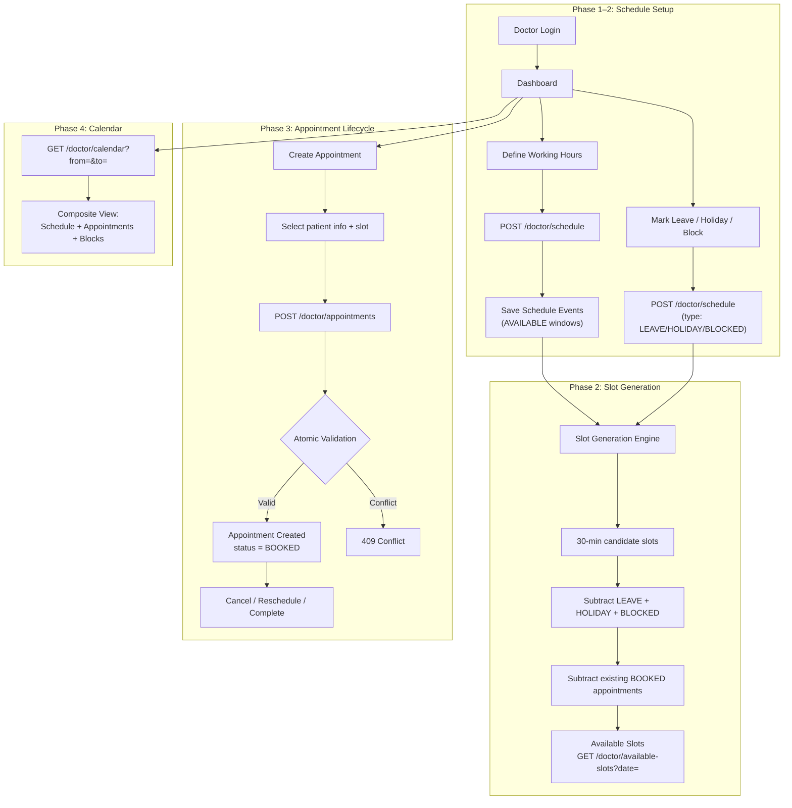
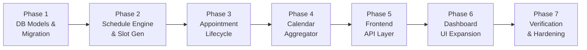

# Stepwise Execution Plan: Doctor Appointment System (Doctor-Only)

## Scope

**In scope (build now):**
- Doctor schedule & availability management (AVAILABLE, LEAVE, HOLIDAY, BLOCKED)
- 30-minute slot generation engine
- Doctor-initiated appointment creation, cancellation, rescheduling, completion
- Doctor operational calendar (composite view)
- Doctor dashboard UI expansion (Calendar, Schedule, Appointments tabs)

**Designed for but NOT built:**
- Patient model, patient auth, patient routes, patient UI
- Appointment Requests table (patient-initiated; doctor creates appointments directly for now)

**Excluded entirely:**
- Notification service (Email / SMS / WhatsApp)
- Payment integration
- Video consultation scheduling

---

## Doctor-Only System Flow



---

## Phase 1: Database Models & Alembic Migration

**Goal:** Create `Schedule` and `Appointment` tables. Design `Appointment` with a nullable `patient_id` FK for future patient system, but don't create the `Patient` model yet.

### 1.1 Schedule Model

**New file:** `backend/app/models/schedule.py`

| Column | Type | Constraints |
| :--- | :--- | :--- |
| `id` | `UUID` | PK, default `uuid4` |
| `doctor_id` | `UUID` | FK → `doctors.id`, NOT NULL, indexed |
| `date` | `Date` | NOT NULL |
| `start_time` | `Time` | NOT NULL |
| `end_time` | `Time` | NOT NULL |
| `type` | `String(20)` | NOT NULL, values: `AVAILABLE`, `LEAVE`, `HOLIDAY`, `BLOCKED` |
| `reason` | `Text` | nullable |
| `created_at` | `DateTime` | `TimestampMixin` |
| `updated_at` | `DateTime` | `TimestampMixin` |

- **Index:** `(doctor_id, date)` composite for fast day lookups.
- **Relationship:** `Doctor` → `schedules` (1:many).

### 1.2 Appointment Model

**New file:** `backend/app/models/appointment.py`

| Column | Type | Constraints |
| :--- | :--- | :--- |
| `id` | `UUID` | PK, default `uuid4` |
| `doctor_id` | `UUID` | FK → `doctors.id`, NOT NULL, indexed |
| `patient_id` | `UUID` | nullable (no FK yet — future `patients.id` FK) |
| `request_id` | `UUID` | nullable (future `appointment_requests.id` FK) |
| `patient_name` | `String(255)` | NOT NULL (inline for now; replaced by FK join later) |
| `patient_contact` | `String(100)` | nullable |
| `date` | `Date` | NOT NULL |
| `start_time` | `Time` | NOT NULL |
| `end_time` | `Time` | NOT NULL |
| `reason` | `Text` | nullable |
| `notes` | `Text` | nullable (doctor's private notes) |
| `status` | `String(20)` | NOT NULL, values: `BOOKED`, `COMPLETED`, `CANCELLED` |
| `created_at` | `DateTime` | `TimestampMixin` |
| `updated_at` | `DateTime` | `TimestampMixin` |

- **Constraint:** `UniqueConstraint("doctor_id", "date", "start_time", name="uq_doctor_appointment_slot")` — prevents double-booking.
- **Index:** `(doctor_id, date)` for calendar queries.
- **Index:** `(doctor_id, status)` for filtered listing.

> [!IMPORTANT]
> `patient_name` and `patient_contact` are inline text fields used now. When the Patient system is built later, `patient_id` becomes a proper FK and these fields become derived from the join. This avoids building the Patient model prematurely while keeping the appointment fully functional.

### 1.3 Model Registration

**Edit:** [`backend/app/models/__init__.py`](file:///Users/mdaffanahmed/VS%20Code/Full%20stack/Doctors%20Platform/backend/app/models/__init__.py) — import `Schedule` and `Appointment`.

### 1.4 Alembic Migration

**New file:** `backend/alembic/versions/006_appointment_system_foundation.py`

- Creates `schedules` and `appointments` tables.
- Adds indexes and unique constraints.
- Verify: `cd backend && alembic upgrade head`.

### 1.5 Pydantic Schemas

**New file:** `backend/app/schemas/schedule.py`

- `ScheduleCreateRequest`: `date`, `start_time`, `end_time`, `type`, `reason?`
- `ScheduleBulkCreateRequest`: `entries: list[ScheduleCreateRequest]`
- `ScheduleResponse`: full schedule event with `id`
- `AvailableSlotResponse`: `start: str`, `end: str`

**New file:** `backend/app/schemas/appointment.py`

- `AppointmentCreateRequest`: `patient_name`, `patient_contact?`, `date`, `start_time`, `end_time`, `reason?`, `notes?`
- `AppointmentResponse`: full appointment with all fields
- `AppointmentRescheduleRequest`: `date`, `start_time`, `end_time`

### Verification
- [ ] `alembic upgrade head` succeeds
- [ ] All models importable without circular dependency
- [ ] Schema validation: create + response round-trips

---

## Phase 2: Schedule Engine & Slot Generation (Backend)

**Goal:** Doctor can define working hours and unavailable periods. System generates 30-minute available slots.

### 2.1 Schedule Service

**New file:** `backend/app/services/schedule_service.py`

Core logic:
1. **`create_schedule_entries(doctor_id, entries)`** — batch insert schedule events with validation (end_time > start_time, no overlapping AVAILABLE windows on same date).
2. **`get_schedule(doctor_id, from_date, to_date)`** — query all schedule events in range.
3. **`delete_schedule_entry(doctor_id, schedule_id)`** — remove with ownership check.
4. **`generate_available_slots(doctor_id, date)`**:
   - Query all `AVAILABLE` entries for doctor + date → candidate intervals.
   - Slice each interval into 30-minute slots.
   - Query `LEAVE`, `HOLIDAY`, `BLOCKED` entries for that date → exclusion intervals.
   - Query `appointments` with `status = BOOKED` for that date → occupied slots.
   - Return only slots that don't overlap any exclusion or occupied interval.

### 2.2 Schedule Routes

**New file:** `backend/app/api/routes/schedule.py`

| Method | Path | Auth | Description |
| :--- | :--- | :--- | :--- |
| `POST` | `/doctor/schedule` | `get_current_doctor` | Create schedule entries (single or bulk) |
| `GET` | `/doctor/schedule` | `get_current_doctor` | List schedule events (query: `from`, `to`) |
| `DELETE` | `/doctor/schedule/{id}` | `get_current_doctor` | Delete a schedule entry |
| `GET` | `/doctor/available-slots` | `get_current_doctor` | Generated slots for a date (doctor's own view) |

**Public slot endpoint** (for future patient use, also useful for the existing public slug page):

| Method | Path | Auth | Description |
| :--- | :--- | :--- | :--- |
| `GET` | `/public/tenants/{slug}/available-slots` | None | Generated slots by slug + date |

### 2.3 Route Registration

**Edit:** [`backend/app/main.py`](file:///Users/mdaffanahmed/VS%20Code/Full%20stack/Doctors%20Platform/backend/app/main.py) — register `schedule_router` with prefix `/doctor` and public slot route under `/public`.

### Verification
- [ ] `POST /doctor/schedule` with AVAILABLE 09:00–13:00 → 201
- [ ] `GET /doctor/available-slots?date=2026-10-12` → 8 slots (09:00–09:30 through 12:30–13:00)
- [ ] Add LEAVE 10:00–12:00 → available slots drop to 4
- [ ] Add HOLIDAY for full day → 0 slots returned
- [ ] Tests: `backend/tests/test_schedule.py`

---

## Phase 3: Appointment Lifecycle (Backend)

**Goal:** Doctor can create, cancel, reschedule, and complete appointments with atomic concurrency protection.

### 3.1 Appointment Service

**New file:** `backend/app/services/appointment_service.py`

1. **`create_appointment(doctor_id, payload)`**:
   - Verify slot falls within an `AVAILABLE` schedule window for that date.
   - Verify no `LEAVE`, `HOLIDAY`, or `BLOCKED` overlap.
   - Verify no existing `BOOKED` appointment at same `(doctor_id, date, start_time)`.
   - Insert with `status = BOOKED`.
   - Catch `IntegrityError` from unique constraint → return 409.

2. **`cancel_appointment(doctor_id, appointment_id)`**:
   - Verify ownership and `status == BOOKED`.
   - Transition to `CANCELLED`.

3. **`complete_appointment(doctor_id, appointment_id)`**:
   - Verify ownership and `status == BOOKED`.
   - Transition to `COMPLETED`.

4. **`reschedule_appointment(doctor_id, appointment_id, new_date, new_start, new_end)`**:
   - Run same availability validation as create for the new slot.
   - Update appointment date/time fields.
   - Status remains `BOOKED`.

5. **`list_appointments(doctor_id, status_filter?, from_date?, to_date?)`**:
   - Filtered query with pagination.

### 3.2 Appointment Routes

**New file:** `backend/app/api/routes/appointment.py`

| Method | Path | Auth | Description |
| :--- | :--- | :--- | :--- |
| `POST` | `/doctor/appointments` | `get_current_doctor` | Create appointment |
| `GET` | `/doctor/appointments` | `get_current_doctor` | List (query: `status`, `from`, `to`) |
| `GET` | `/doctor/appointments/{id}` | `get_current_doctor` | Get single appointment |
| `POST` | `/doctor/appointments/{id}/cancel` | `get_current_doctor` | Cancel |
| `POST` | `/doctor/appointments/{id}/complete` | `get_current_doctor` | Complete |
| `PATCH` | `/doctor/appointments/{id}` | `get_current_doctor` | Reschedule (new date/time) |

### 3.3 Route Registration

**Edit:** [`backend/app/main.py`](file:///Users/mdaffanahmed/VS%20Code/Full%20stack/Doctors%20Platform/backend/app/main.py) — register `appointment_router`.

### Verification
- [ ] Create appointment in valid slot → 201 BOOKED
- [ ] Create duplicate slot → 409 Conflict
- [ ] Create outside AVAILABLE window → 400
- [ ] Create during LEAVE → 400
- [ ] Cancel → status transitions to CANCELLED, slot freed
- [ ] Complete → status transitions to COMPLETED
- [ ] Reschedule to valid slot → updated, old slot freed
- [ ] Reschedule to occupied slot → 409
- [ ] Tests: `backend/tests/test_appointment_lifecycle.py`

---

## Phase 4: Doctor Calendar Aggregator (Backend)

**Goal:** Single endpoint that composes schedules + appointments into a unified calendar view.

### 4.1 Calendar Service

**New file:** `backend/app/services/calendar_service.py`

**`get_doctor_calendar(doctor_id, from_date, to_date)`**:
- Query schedules in range → group by date.
- Query appointments in range → group by date.
- For each date, generate time-ordered event list:

```json
{
  "dates": [
    {
      "date": "2026-10-12",
      "events": [
        { "type": "AVAILABLE", "start": "09:00", "end": "09:30" },
        { "type": "APPOINTMENT", "start": "09:30", "end": "10:00", "patient_name": "Patient A", "status": "BOOKED", "appointment_id": "..." },
        { "type": "BLOCKED", "start": "11:00", "end": "12:00", "reason": "Personal work" },
        { "type": "LEAVE", "start": "12:00", "end": "13:00" }
      ]
    }
  ]
}
```

### 4.2 Calendar Route

Add to `backend/app/api/routes/schedule.py` (or separate `calendar.py`):

| Method | Path | Auth | Description |
| :--- | :--- | :--- | :--- |
| `GET` | `/doctor/calendar` | `get_current_doctor` | Query: `from`, `to` (max 31 days) |

### Verification
- [ ] Calendar shows AVAILABLE gaps, BOOKED appointments, LEAVE/BLOCKED periods correctly
- [ ] Cancelled appointments don't block slots
- [ ] Empty date range returns empty array
- [ ] Tests: extend `test_schedule.py` or new `test_calendar.py`

---

## Phase 5: Frontend API Layer (`lib/api.ts`)

**Goal:** Add typed interfaces and client functions for schedule, appointment, and calendar.

### 5.1 Type Definitions

Add to [`lib/api.ts`](file:///Users/mdaffanahmed/VS%20Code/Full%20stack/Doctors%20Platform/lib/api.ts):

```typescript
// Schedule types
export type ScheduleType = "AVAILABLE" | "LEAVE" | "HOLIDAY" | "BLOCKED";

export interface ScheduleEntry {
  id: string;
  date: string;
  start_time: string;
  end_time: string;
  type: ScheduleType;
  reason?: string;
}

export interface ScheduleCreatePayload {
  date: string;
  start_time: string;
  end_time: string;
  type: ScheduleType;
  reason?: string;
}

export interface AvailableSlot {
  start: string;
  end: string;
}

// Appointment types
export type AppointmentStatus = "BOOKED" | "COMPLETED" | "CANCELLED";

export interface AppointmentEntry {
  id: string;
  patient_name: string;
  patient_contact?: string;
  date: string;
  start_time: string;
  end_time: string;
  reason?: string;
  notes?: string;
  status: AppointmentStatus;
  created_at: string;
}

export interface AppointmentCreatePayload {
  patient_name: string;
  patient_contact?: string;
  date: string;
  start_time: string;
  end_time: string;
  reason?: string;
  notes?: string;
}

export interface AppointmentReschedulePayload {
  date: string;
  start_time: string;
  end_time: string;
}

// Calendar types
export interface CalendarEvent {
  type: ScheduleType | "APPOINTMENT";
  start: string;
  end: string;
  reason?: string;
  patient_name?: string;
  status?: AppointmentStatus;
  appointment_id?: string;
}

export interface CalendarDay {
  date: string;
  events: CalendarEvent[];
}

export interface DoctorCalendarResponse {
  dates: CalendarDay[];
}
```

### 5.2 Client Functions

```text
createDoctorSchedule(entries)     → POST /doctor/schedule
getDoctorSchedule(from, to)       → GET  /doctor/schedule
deleteDoctorSchedule(id)          → DELETE /doctor/schedule/{id}
getDoctorAvailableSlots(date)     → GET  /doctor/available-slots
getPublicAvailableSlots(slug, d)  → GET  /public/tenants/{slug}/available-slots

createAppointment(payload)        → POST /doctor/appointments
getDoctorAppointments(filters)    → GET  /doctor/appointments
getAppointment(id)                → GET  /doctor/appointments/{id}
cancelAppointment(id)             → POST /doctor/appointments/{id}/cancel
completeAppointment(id)           → POST /doctor/appointments/{id}/complete
rescheduleAppointment(id, payload)→ PATCH /doctor/appointments/{id}

getDoctorCalendar(from, to)       → GET  /doctor/calendar
```

---

## Phase 6: Doctor Dashboard UI Expansion

**Goal:** Transform [`app/dashboard/page.tsx`](file:///Users/mdaffanahmed/VS%20Code/Full%20stack/Doctors%20Platform/app/dashboard/page.tsx) from a monolithic profile editor into a tabbed workspace.

### 6.1 Dashboard Navigation Structure

```text
Doctor Dashboard
├── Overview         (daily stats, today's appointments, pending count)
├── Calendar         (day/week view — composite schedule + appointments)
├── Schedule         (manage working hours, mark leave/holiday/block)
├── Appointments     (list view with Cancel/Complete/Reschedule actions)
├── Profile          (existing profile editor — move from current dashboard)
└── Android App      (existing APK builder — move from current dashboard)
```

### 6.2 Component Breakdown

| Component | File | Description |
| :--- | :--- | :--- |
| `DashboardShell` | `components/dashboard/DashboardShell.tsx` | Sidebar/tab nav + content area |
| `OverviewTab` | `components/dashboard/OverviewTab.tsx` | Today's summary cards |
| `CalendarTab` | `components/dashboard/CalendarTab.tsx` | Day view with time grid, color-coded events |
| `ScheduleTab` | `components/dashboard/ScheduleTab.tsx` | Add working hours, mark leave/holiday/block |
| `AppointmentsTab` | `components/dashboard/AppointmentsTab.tsx` | Filterable appointment table with action buttons |
| `ProfileTab` | `components/dashboard/ProfileTab.tsx` | Extract existing profile form from dashboard |
| `AndroidAppTab` | `components/dashboard/AndroidAppTab.tsx` | Extract existing APK builder from dashboard |

### 6.3 Calendar Day View Spec

```text
┌─────────────────────────────────────────┐
│  ◀ Mon 12 Oct 2026 ▶       [Week View] │
├─────────────────────────────────────────┤
│ 09:00  ░░░ Available                    │
│ 09:30  ██ Patient A — Booked            │
│ 10:00  ██ Patient B — Booked            │
│ 10:30  ░░░ Available                    │
│ 11:00  ▓▓▓ BLOCKED: Personal Work       │
│ 11:30  ░░░ Available                    │
│ 12:00  ▒▒▒ LEAVE                        │
│ 12:30  ▒▒▒ LEAVE                        │
│ ─── Break ───                           │
│ 16:00  ░░░ Available                    │
│ 16:30  ██ Patient C — Booked            │
│ 17:00  ░░░ Available                    │
│ ...                                     │
└─────────────────────────────────────────┘
```

### 6.4 Schedule Management UI

```text
┌────────────────────────────────────────┐
│ Working Hours                          │
│                                        │
│ Monday    09:00 - 13:00  [Edit] [Del]  │
│           16:00 - 20:00  [Edit] [Del]  │
│ Tuesday   09:00 - 13:00  [Edit] [Del]  │
│ ...                                    │
│                                        │
│ [+ Add Working Hours]                  │
├────────────────────────────────────────┤
│ Leave / Holidays / Blocks              │
│                                        │
│ [Mark Leave]  [Add Holiday]  [Block]   │
│                                        │
│ 15 Oct  Full Day  HOLIDAY: Eid         │
│ 18 Oct  10:00-12:00  LEAVE             │
└────────────────────────────────────────┘
```

### 6.5 Appointment Creation Flow (Doctor-initiated)

```text
[+ New Appointment] button
        ↓
Modal / Slide-out:
  - Patient Name (text input)
  - Patient Contact (optional)
  - Date (date picker)
  - Available Slots (auto-loaded from GET /doctor/available-slots)
  - Reason (text area)
  - Notes (text area, private)
        ↓
[Create Appointment]
        ↓
POST /doctor/appointments
```

### 6.6 Public Slug Page Update

**Edit:** [`app/[slug]/page.tsx`](file:///Users/mdaffanahmed/VS%20Code/Full%20stack/Doctors%20Platform/app/%5Bslug%5D/page.tsx):
- Replace hardcoded `TIME_SLOTS` array with dynamic date picker + call to `getPublicAvailableSlots(slug, date)`.
- Show real available slots from the doctor's schedule.
- Keep the existing stub appointment submission for now (no patient auth required yet).

---

## Phase 7: Verification & Hardening

### 7.1 Backend Tests

| Test File | Coverage |
| :--- | :--- |
| `test_schedule.py` | CRUD, bulk create, overlap validation, deletion with ownership |
| `test_slot_generation.py` | Slot math, leave exclusion, holiday exclusion, booked slot exclusion |
| `test_appointment_lifecycle.py` | Create, cancel, complete, reschedule, duplicate slot 409, invalid slot 400 |
| `test_calendar.py` | Composite view correctness, date range queries |

### 7.2 Frontend Validation

- `npx tsc --noEmit` — zero TypeScript errors
- All new components use `brand-*` Tailwind colors
- `"use client"` only on stateful components

### 7.3 Migration Verification

```bash
cd backend && alembic upgrade head    # clean migration
cd backend && alembic downgrade -1    # rollback works
cd backend && alembic upgrade head    # re-apply clean
```

---

## Future Patient Extension Points

When the Patient system is built later, the exact changes will be:

| Step | Change |
| :--- | :--- |
| 1 | Create `backend/app/models/patient.py` (UUID PK, TimestampMixin, email, password, profile fields) |
| 2 | Create `backend/app/models/appointment_request.py` (PENDING → CONVERTED/REJECTED lifecycle) |
| 3 | Add `patient_id` FK constraint on `appointments.patient_id` (currently nullable UUID column) |
| 4 | Add `request_id` FK constraint on `appointments.request_id` |
| 5 | Add `role` claim to JWT tokens, update `get_current_doctor` to verify role |
| 6 | Create `get_current_patient` dependency in `deps.py` |
| 7 | Create patient auth routes (`/auth/patient/register`, `/auth/patient/login`) |
| 8 | Create patient routes (`/patient/appointments`, `/patient/calendar`, `/patient/requests`) |
| 9 | Add patient UI pages (`/patient/dashboard`, `/patient/login`, `/patient/register`) |
| 10 | Convert doctor booking flow from direct-create to request-review-book pipeline |

> [!NOTE]
> The `appointments` table already has `patient_id` (nullable UUID) and `request_id` (nullable UUID) columns ready for FK constraints. No destructive schema change needed.

---

## Execution Order Summary



**Estimated file changes:**
- **New files:** ~12 (2 models, 2 schemas, 3 services, 2 routes, ~6 UI components, 4 test files)
- **Edited files:** ~4 (`models/__init__.py`, `main.py`, `lib/api.ts`, `app/[slug]/page.tsx`)
- **New migration:** 1 (`006_appointment_system_foundation.py`)
